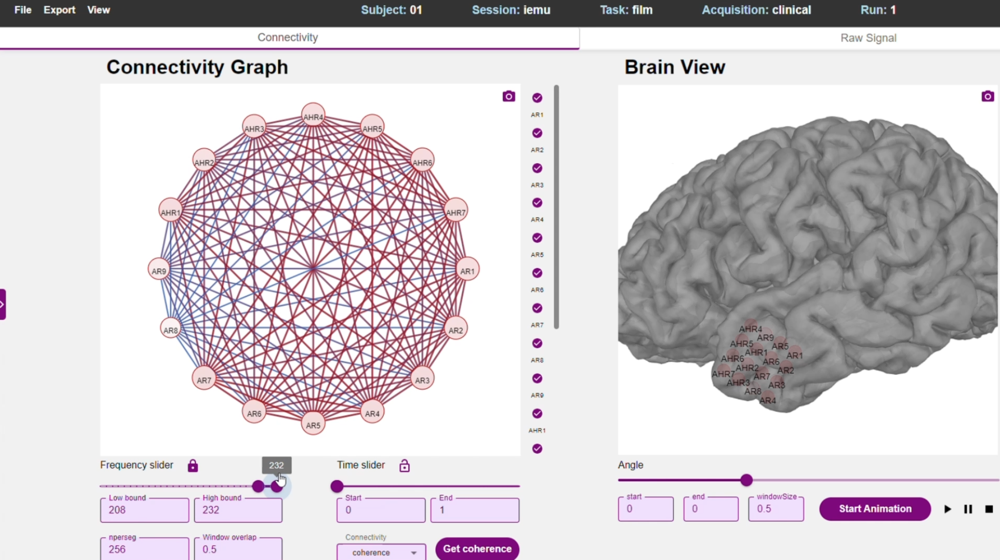

# My-COG: ECoG Connectivity Visualization Tool

## Overview

### Objective
The goal of this project is to develop a software tool that receives, processes, and visualizes ECoG data using graph theory-based connectivity analysis. Neuroscientists and clinicians can interact with and analyze the data to gain insights into brain activity and connectivity.

### Project Background and Motivation
In awake brain surgery, surgeons need to determine whether to remove a brain section while avoiding damage to critical areas. Direct Electrical Stimulation (DES) helps map specific brain functions but is time-consuming and limited in scope.

Electrocorticography (ECoG) records neural activity from electrodes placed directly on the brain's surface. Analyzing ECoG data allows for a broader understanding of brain connectivity, helping surgeons and researchers make informed decisions about neurological conditions and surgical approaches.

### Check it out! 👇

[](https://youtu.be/nWfnXMeuaLM)


## Features
- **Data Upload & Storage**: Users can upload ECoG data in BIDS format, process it, and store results in a session.
- **Connectivity Graph Visualization**: The system provides interactive network graphs representing brain connectivity.
- **Brain Model Representation**: Adjustable 3D brain model with electrode placement visualization.
- **Dynamic Analysis & Customization**: Users can filter data, adjust analysis parameters, and refine connectivity settings.
- **Session Management**: Save analysis sessions for later review and export results in multiple formats (.mat, images, videos).
- **Performance Optimization**: Cache system to prevent redundant recalculations.

## Architecture
- **Frontend:** TypeScript, React.js (Graphin & Lightning Charts for visualization).
- **Backend:** Python, Flask (Handles data processing and session management).
- **Data Processing:** MNE.Bids Python library for handling BIDS-format ECoG data.
- **Database & Caching:** Stores session data and analysis results for fast retrieval.

## User Workflow
1. **Data Upload & Preparation**
   - Users log in and upload ECoG data files.
   - Previously uploaded data can be accessed from saved sessions.
2. **Data Visualization**
   - ECoG signals are displayed in various formats: time-series plots, connectivity graphs, and 3D brain models.
   - Users interact with visual elements, adjusting analysis parameters.
3. **Graph Model Interaction**
   - Customize connectivity visualization (color schemes, thresholds, frequency ranges, etc.).
   - Hide or highlight specific electrodes and adjust time windows.
4. **Brain Model Interaction**
   - Adjust the electrode grid placement on the brain model.
   - Rotate, zoom, and interact with the 3D visualization.
5. **Session Saving & Exporting**
   - Save settings and visualizations for later sessions.
   - Export processed data as .mat files, videos, or images.
6. **Connectivity Analysis Adjustments**
   - Select and apply different connectivity methods.
   - System updates visualizations accordingly.

## Installation & Setup
### Prerequisites
- Node.js & npm (for frontend development)
- Python 3.x (for backend development)
- Flask & required Python libraries (`pip install -r requirements.txt`)

### Running the Project
1. **Clone the Repository:**
   ```sh
   git clone https://github.com/your-repo/my-cog.git
   cd my-cog
   ```
2. **Setup Backend:**
   ```sh
   cd PyCoG
   python -m venv venv
   source venv/bin/activate  # On Windows use `venv\Scripts\activate`
   pip install -r requirements.txt
   flask run
   ```
3. **Setup Frontend:**
   ```sh
   cd my-cog
   npm install
   npm start
   ```

## Future Enhancements
- Support for additional neuroimaging data formats.
- Integration with cloud storage for data access across sessions.
- Improved real-time processing for live data analysis.

## Contributors
- **Michael Saar**  
- **Dekel Eli**  
- **Mentor:** Dr. Yaara Erez

## License
This project is licensed under the MIT License - see the [LICENSE](LICENSE) file for details.

---
For any inquiries or contributions, feel free to open an issue or pull request!


